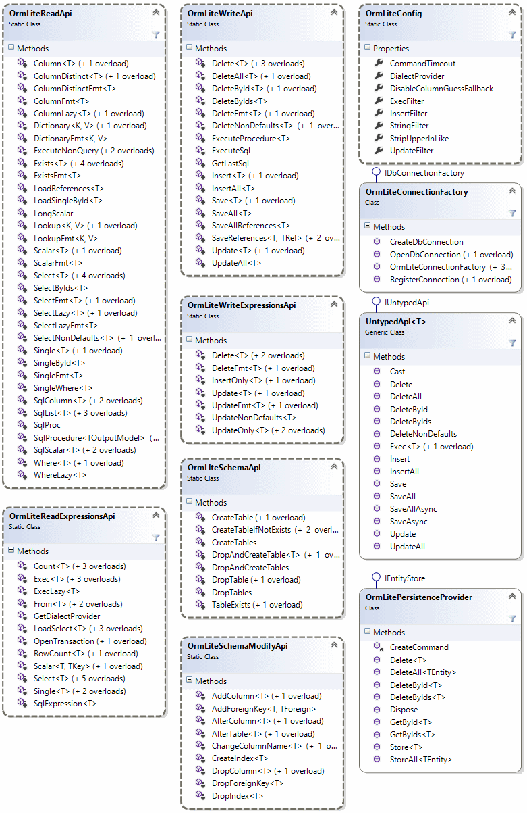

# 概述
[ServiceStack.OrmLite](https://github.com/ServiceStack/ServiceStack.OrmLite)是基于.NET的ORM工具，提供了对多种数据库（目前包含： Sql Server, Sqlite, MySql, PostgreSql, Firebird）的支持。
它提供了一些 System.Data命名空间中的类（主要是IDbConnection)的扩展方法。提供一个POCO类与一个RDBMS表的映射。另外还提供了根据POCO类来Create/Drop表的接口。并且同时支持.NET和Mono平台。

# 安装
可以直接在项目中使用NuGet方式安装。
[](https://www.nuget.org/packages?q=servicestack+ormlite)

针对不能数据库，共有如下几个库。

- [ServiceStack.OrmLite.SqlServer](http://nuget.org/List/Packages/ServiceStack.OrmLite.SqlServer)
- [ServiceStack.OrmLite.PostgreSQL](http://nuget.org/List/Packages/ServiceStack.OrmLite.PostgreSQL)
- [ServiceStack.OrmLite.MySql](http://nuget.org/List/Packages/ServiceStack.OrmLite.MySql)
- [ServiceStack.OrmLite.Sqlite.Mono](http://nuget.org/packages/ServiceStack.OrmLite.Sqlite.Mono) - Compatible with Mono / Windows (x86)
- [ServiceStack.OrmLite.Sqlite.Windows](http://nuget.org/List/Packages/ServiceStack.OrmLite.Sqlite.Windows) - 32/64bit Mixed mode .NET for Windows only
- [ServiceStack.OrmLite.Oracle](http://nuget.org/packages/ServiceStack.OrmLite.Oracle) (非官方)
- [ServiceStack.OrmLite.Firebird](http://nuget.org/List/Packages/ServiceStack.OrmLite.Firebird)  (非官方)
- [ServiceStack.OrmLite.VistaDb](http://nuget.org/List/Packages/ServiceStack.OrmLite.VistaDb)  (非官方)

# 使用
安装后可以用两种方式来创建一个IDbConnectionFactory。一种是直接创建，比如：

```csharp
var dbFactory = new OrmLiteConnectionFactory(
    connectionString,
    SqlServerDialet.Provider);
```

一种是通过Ioc的方式注册与一个单例。比如：

```csharp
container.Register<IDbConnectionFactory>(c=>
    new OrmLiteConnectionFactory(connectionString, SqlServerDialet.Provider));
```

其中`connectionString`是数据库的链接字符串。`SqlServerDialet.Provider`是针对SqlServer的提供者。所有提供者清单如下：

    SqlServerDialet.Provider      //任何SqlServer版本
    SqlServer2012Dialet.Provider  //SqlServer 2012+
    SqliteDialet.Provider         //Sqlite
    PostgreSqlDialet.Provider     //PostgreSQL
    OracleDialet.Provider         //Oracel
    FirebirdDialet.Provider       //Firebird
    VistaDbDialect.Provider       //Vista DB

你可以使用`dbFactory`打开一个ADO.NET DB链接。如果数据库是空的， 你可以使用OrmLite的建表API根据POCO类创建任务表，并初始化数据。例如：

```csharp
using(var db = dbFactory.Open()){
  if(db.CreateTableIfNotExists<Poco>()){
    db.Insert(new Poco{ Id = 1, Name = "Seed Data"});
  }

  var result = db.SingleById<Poco>(1);
  result.PrintDump(); /= {Id: 1, Name: Seed Data}
}
```

## 异步支持(Async)
ServiceStack.OrmLite提供了.NET4.5的异步支持。

同步版本：

```csharp
db.Insert(new Employee { Id = 1, Name = "Employee 1" });
db.Save(product1, product2);
var customer = db.Single<Customer>(new { customer.Email });
```

异步版本:

```csharp
await db.InsertAsync(new Employee { Id = 1, Name = "Employee 1" });
await db.SaveAsync(product1, product2);
var customer = await db.SingleAsync<Customer>(new { customer.Email });
```

目前只有以下RDBMS提供程序支持异步API。

  - [SQL Server .NET 4.5+](https://www.nuget.org/packages/ServiceStack.OrmLite.SqlServer)
  - [PostgreSQL .NET 4.5+](https://www.nuget.org/packages/ServiceStack.OrmLite.PostgreSQL)
  - [MySQL .NET 4.5+](https://www.nuget.org/packages/ServiceStack.OrmLite.MySql)

## 动态结果集
ServiceStack.OrmLite还支持返回非结构化的结果集。使用`List<object>`来代替返回具体的POCO类。例如：

```csharp
db.Select<List<object>>(db.From<Poco>()
  .Select("COUNT(*), MIN(Id), MAX(Id)"))[0].PrintDump();
```

返回 `List<object>`:

    [
        10,
        1,
        10
    ]

你还可以使用 `Dictionary<string,object>` 来返回结果:

```csharp
db.Select<Dictionary<string,object>>(db.From<Poco>()
  .Select("COUNT(*) Total, MIN(Id) MinId, MAX(Id) MaxId"))[0].PrintDump();
```

返回 `Dictionary<string,object>`:

    {
        Total: 10,
        MinId: 1,
        MaxId: 10
    }

# 例子
ServiceStack.OrmLite提供了用简单的 lambda 表达式和类似LINQ的SQL表达式来进行数据操作。

## 使用Select查询

```csharp
int agesAgo = DateTime.Today.AddYears(-20).Year;
db.Select<Author>(x => x.Birthday >= new DateTime(agesAgo, 1, 1)
                    && x.Birthday <= new DateTime(agesAgo, 12, 31));
```

```csharp
db.Select<Author>(x => Sql.In(x.City, "London", "Madrid", "Berlin"));
```

```csharp
db.Select<Author>(x => x.Earnings <= 50);
```

```csharp
db.Select<Author>(x => x.Name.StartsWith("A"));
```

```csharp
db.Select<Author>(x => x.Name.EndsWith("garzon"));
```

```csharp
db.Select<Author>(x => x.Name.Contains("Benedict"));
```

```csharp
db.Select<Author>(x => x.Rate == 10 && x.City == "Mexico");
```

## 其它取数据的接口

```csharp
Person person = db.SingleById<Person>(1);
```

```csharp
Person person = db.Single<Person>(x => x.Age == 42);
```

```csharp
var q = db.From<Person>()
          .Where(x => x.Age > 40)
          .Select(Sql.Count("*"));

int peopleOver40 = db.Scalar<int>(q);
```

```csharp
int peopleUnder50 = db.Count<Person>(x => x.Age < 50);
```

```csharp
bool has42YearOlds = db.Exists<Person>(new { Age = 42 });
```

```csharp
int maxAgeUnder50 = db.Scalar<Person, int>(x => Sql.Max(x.Age), x => x.Age < 50);
```

```csharp
var q = db.From<Person>()
    .Where(x => x.Age == 27)
    .Select(x => x.LastName);

List<string> results = db.Column<string>(q);
```

```csharp
var q = db.From<Person>()
          .Where(x => x.Age < 50)
          .Select(x => x.Age);

HashSet<int> results = db.ColumnDistinct<int>(q);
```

```csharp
var q = db.From<Person>()
          .Where(x => x.Age < 50)
          .Select(x => new { x.Id, x.LastName });

Dictionary<int,string> results = db.Dictionary<int, string>(q);
```

```csharp
var q = db.From<Person>()
          .Where(x => x.Age < 50)
          .Select(x => new { x.Age, x.LastName });

Dictionary<int, List<string>> results = db.Lookup<int, string>(q);
```
## INSERT, UPDATE 和 DELETEs

首先定义一个POCO类 Person。后面的操作都使用该类进行操作。

```csharp
public class Person
{
    public int Id { get; set; }
    public string FirstName { get; set; }
    public string LastName { get; set; }
    public int? Age { get; set; }
}
```

### UPDATE

下面最简单的格式中，Update将更新除了**Id**外的所有字段。**Id**字段用来限定具体记录。

```csharp
db.Update(new Person { Id = 1, FirstName = "Jimi", LastName = "Hendrix", Age = 27});
```
如果你提供了 where 表达式，它会更新每一个字段，但是使用你定义的过滤条件。

```csharp
db.Update(new Person { Id = 1, FirstName = "JJ" }, p => p.LastName == "Hendrix");
```

如果想限定更新的字段，可以使用 **匿名类**。如下只会更新`FirstName`一个字段。

```csharp
db.Update<Person>(new { FirstName = "JJ" }, p => p.LastName == "Hendrix");
```

#### UpdateOnly

更新部分字段是常用操作，所有提供了特别针对该需求的**UpdateOnly**方法。

`UpdateOnly`语句的第一个表达式`p => p.Firstname`定义了哪些字段要更新。

```csharp
db.UpdateOnly(new Person { FirstName = "JJ" }, p => p.FirstName);
```
```csharp
db.UpdateOnly(new Person { FirstName = "JJ", Age = 12 },
    onlyFields: p => new { p.FirstName, p.Age });
```

```csharp
db.UpdateOnly(new Person { FirstName = "JJ" },
    onlyFields: p => p.FirstName,
    where: p => p.LastName == "Hendrix");
```

除了上面的表达式过滤器外，还支持以 ExpressonVisitor 构造器以编程的方式构造Update语句。

```csharp
var q = db.From<Person>()
          .Update(p => p.FirstName);

db.UpdateOnly(new Person { FirstName = "JJ", LastName = "Hendo" }, onlyFields: q);
```

```csharp
var q = db.From<Person>()
          .Where(x => x.FirstName == "Jimi")
          .Update(p => p.FirstName);

db.UpdateOnly(new Person { FirstName = "JJ" }, onlyFields: q);
```

### INSERT

Insert的接口很直观。

```csharp
db.Insert(new Person { Id = 1, FirstName = "Jimi", LastName = "Hendrix", Age = 27 });
```
如果你不想插入所有字段，可以用如下方式只插入部分字段。

```csharp
var q = db.From<Person>()
          .Insert(p => new { p.FirstName });

db.InsertOnly(new Person { FirstName = "Amy" }, onlyFields: q)
```

### DELETE

Delete接口像Update接口一样，支持where表达式。
```csharp
db.Delete<Person>(p => p.Age == 27);
```

或者一个 Expression Visitor:
```csharp
var q = db.From<Person>()
          .Where(p => p.Age == 27);

db.Delete<Person>(q);
```

同样支持基于字符串的表达式。
```csharp
db.Delete<Person>(where: "Age = {0}".SqlFmt(27));
```

另外还提供了不需要POCO模型的接口。

```csharp
db.Delete(table: "Person", where: "Age = {0}".SqlFmt(27));
```

# API 概述

完整API如下图:

[](OrmLiteApi.png)

# 其它特性

`ServiceStack.OrmLite`中的`SqlExpression`提供了强大的查询构建器的功能。支持分页，分组，联表，排序等SQL提供的一系列功能。

## 分页示例

通过`SqlExpression`可以很简单的实现分页功能。例如：

```csharp
var builder = db.From<Person>();  //创建一个SqlExpression

builder.Where(x => x.Age > 10);
//可以添加额外的查询条件

var count = db.Count(builder);  //得到这个查询条件的记录总数
builder.OrderBy(x => x.Name);   //添加排序

builder.Limit(skip, rows);      //分页参数，skip表示从第几行开始，rows表示返回的记录数

var result = db.Select(builder);   //得到分页结果
```

## Join

借助`SqlExpression`同样可以轻松实现Join的功能。
假设有以下两个类：

```csharp
class Customer {
    public int Id { get; set; }
    ...
}
class CustomerAddress {
    public int Id { get; set; }
    public int CustomerId { get; set; }   //对应 Customer.Id
}
```

如果要取出所有包含客户地址的客户信息列表，可以使用如下语句：

```csharp
var q = db.From<Customer>().Join<CustomerAddress>();

var dbCustomers = db.Select<Customer>(q);
```

上面的例子使用了按约定的关联方式。 如： `Customer.Id` 对应 `CustomerAddress.CustomerId`，当然也可以自定义。

```csharp
var q = db.From<Customer>().Join<Customer,CustomerAddress>((cust,address) => cust.Id == address.CustomerId);

var dbCustomers = db.Select(q);
```

上面的代码会生成类似如下的SQL语句：

```sql
SELECT Customer.* 
  FROM Customer 
       INNER JOIN 
       CustomerAddress ON (Customer.Id == CustomerAddress.Id)
```

`SqlExpression`除了支持`Join`，还支持`LeftJoin`,`RightJoin`,`FullJoin`等其它Join方式。

